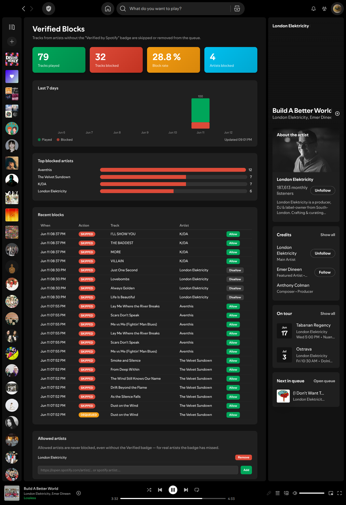

# spicetify-verified-only

A [Spicetify](https://spicetify.app/) extension that automatically skips tracks from artists
without the **[Verified by Spotify](https://newsroom.spotify.com/2026-04-30/verified-by-spotify-badge-artist-details/)**
badge (introduced April 2026) - plus a Pi-hole-style dashboard showing every play and block.

Spotify states that AI-generated artists are not eligible for the badge, so in practice this
filters AI-generated music out of your autoplay, radio, and queue.



## What it does

- **Queue pruning** - tracks you (or anything else) add to the queue are checked and removed
  within ~100 ms if the artist isn't verified.
- **Auto-skip** - tracks injected by autoplay/radio (which can't be removed from the queue)
  are skipped the moment they start.
- **Skip-storm guard** - after 5 consecutive unverified tracks, playback pauses instead of
  skipping forever through an all-unverified context.
- **Dashboard** - a "Verified Blocks" page in Spotify's sidebar with total plays/blocks,
  block rate, a 7-day activity chart, top blocked artists, and a recent-blocks table.
- **Allowed artists** - real artists the badge has missed can be allowed permanently: click
  "Allow" on a recent block, or paste an artist link in the dashboard. Allowed artists are
  never blocked.

Verdicts are cached for 7 days (one lookup per artist), and the filter **fails open**: if a
lookup errors or Spotify changes the schema, nothing is blocked. Local files and podcasts are
ignored.

## How it works

The official Web API does not expose verification status. The Spotify client fetches it
through the internal GraphQL API (`queryArtistOverview`), where it lives at:

```
data.artistUnion.onPlatformReputationTrait.verification.{ isRegistered, isVerified }
```

`isVerified` is the new badge. **`isRegistered` is not the same thing** - it's the old
checkmark (profile claimed in Spotify for Artists), which even AI artists have. This extension
filters on `isVerified` only.

## Install

Requires Spicetify and Spotify Premium.

```sh
git clone https://github.com/alexanderhenne/spicetify-verified-only.git
cd spicetify-verified-only
cp verified-only.js "$(dirname "$(spicetify -c)")/Extensions/"
cp -r verified-dashboard "$(dirname "$(spicetify -c)")/CustomApps/"
spicetify config extensions verified-only.js
spicetify config custom_apps verified-dashboard
spicetify apply
```

Restart Spotify. The dashboard appears as a shield icon ("Verified Blocks") in the sidebar.

## Uninstall

```sh
spicetify config extensions verified-only.js- custom_apps verified-dashboard-
spicetify apply
```

## Configuration

Constants at the top of `verified-only.js`:

| Constant | Default | Meaning |
|---|---|---|
| `CACHE_TTL_MS` | 7 days | How long an artist's verified verdict is cached |
| `MAX_CONSECUTIVE_SKIPS` | 5 | Consecutive skips before pausing playback |
| `QUEUE_LOOKAHEAD` | 10 | Upcoming tracks checked per queue update |

Stats, event history, and the allowed-artists list live in the client's LocalStorage under
`verifiedOnly:*`. To reset the dashboard, clear those keys from the developer console.

## Caveats

- Uses Spotify's internal, undocumented API - it can break without notice when Spotify
  changes the client.
- Only the track's primary artist is checked.

## License

[MIT](LICENSE)
